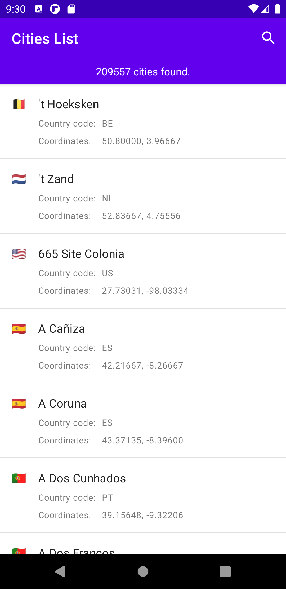
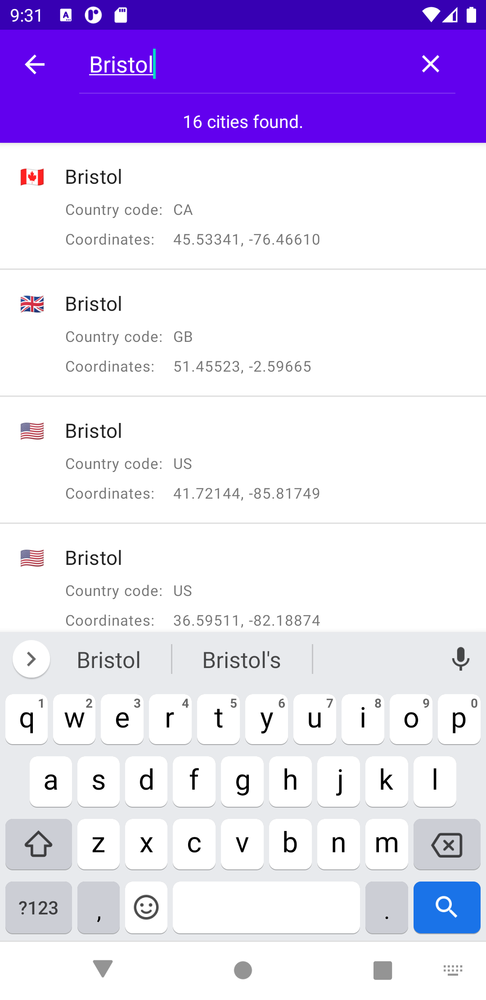
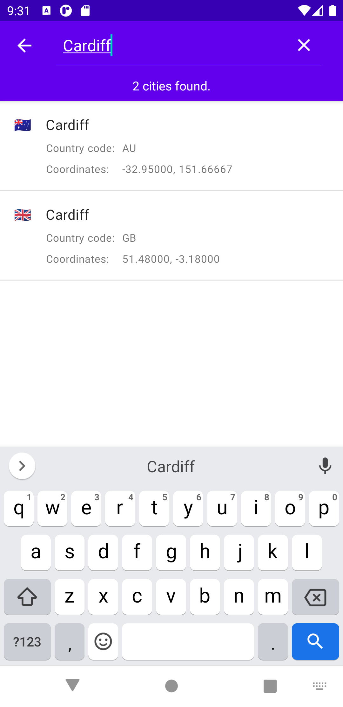
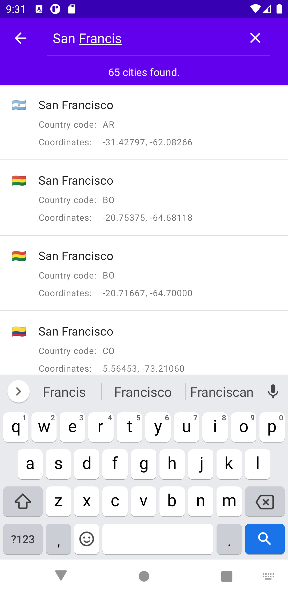
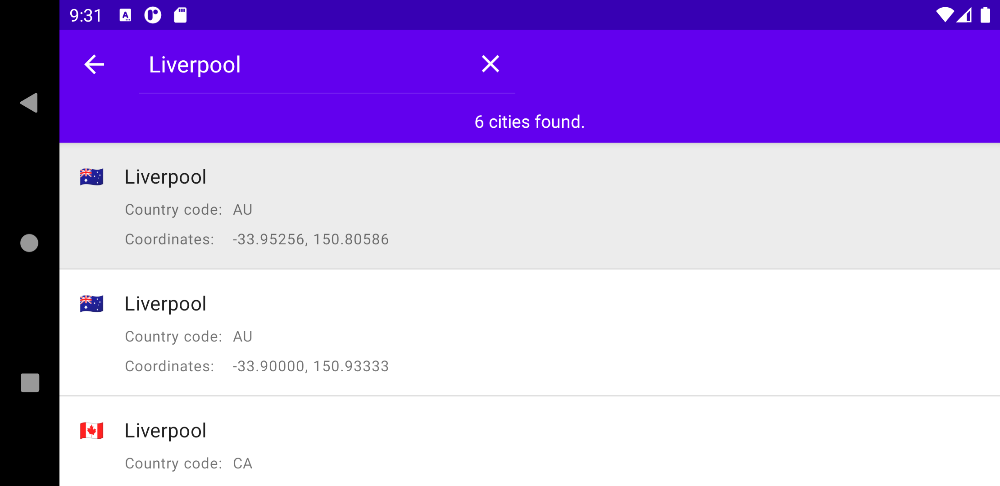

# Cities List

## About

This project is an experiment where I explored some libraries and techniques from modern Android development.

Features available in the app:

- Display a sorted list of 200k+ worldwide cities. 
- Search cities that match a case insensitive prefix/query.
- Show the location of a selected city on a map.

## Highlights

* Wrote the entire application using Kotlin.
* Used Coroutines to implement asynchronous code execution.
* Applied an MVVM-like architecture with ViewModels that expose view states and events using Flows.
* The UI supports screen rotation and provides loading, error, and empty states.
* Implemented the dependency injection using Hilt.
* Encoded and decoded JSONs using Kotlin Serialization.
* Showcased two different approaches to implement test doubles on unit tests: Mocks and Fakes.
* Implemented the search functionality using an adaptation of Binary Search that finds the leftmost and rightmost items that match with a query.
* Used an "async lazy" approach to prepare the cities list before the first search. Check @elizarov's last comment (or the comments at the top of the file) on [this gist](https://gist.github.com/elizarov/f27400a55c1502aacc35b4a3b2f5c9af) for more information.

## Screenshots / Video

| First screen | Searching for `Bristol` | Searching for `Cardiff` | Searching for `San Francis` |
|-----|-----|-----|-----|
|  |  |  |  |

| Searching for `Campinas` | Searching for `Liverpool` |
|-----|-----|
|  |  |


| Video |
|-----|
|  |

## Building and Running

I developed this project using `Android Studio Arctic Fox (2020.3.1)`, `AGP 7.0` and `JDK 11`. So I strongly recommend using them to build and run it.

Additionally, it's necessary to create an API key for Maps SDK for Android and add it to the `local.properties` file inside the project's root folder. To do that, please follow the steps described on "[Set up a Cloud Project and API key](https://developers.google.com/maps/documentation/android-sdk/config#set_up_a_cloud_project_and_api_key)" from Google's documentation.

## Improvement points

- Split the `app` module into multiple modules, using a semantic similar to the current package organisation.
- Extract the search logic from `BinarySearchCitiesRepository`, making it more generic, and allowing the app to use different algorithms to test.
- Enable pre-push git hooks to run static code analysis and linters, avoiding pushing code with some types of problems.
- Setup some CI solution to run unit tests for each push or PR.
- Implement UI and Integration tests.
- Naming is hard. So is package organization. I probably need to revisit them at some point :grimacing:

## Libraries used 

| | |
|-----|-----|
| Kotlin | -  Coroutines<br>- Serialization |
| Jetpack | - Hilt (Dependency Injection)<br>- AppCompat<br>- Navigation<br>- core-ktx<br>- fragment-ktx<br>- Material<br>- Constraint Layout<br>- RecyclerView
| Maps | Maps SDK for Android |
| Tests | - Google Truth (to implement nicer test assertions)<br>- Mockito Kotlin<br>- Coroutines Test<br>- Kotlin Fixture (to avoid creating test objects manually) |

## License

```
MIT License

Copyright (c) [2021] [Felipe Augusto Pedroso]

Permission is hereby granted, free of charge, to any person obtaining a copy
of this software and associated documentation files (the "Software"), to deal
in the Software without restriction, including without limitation the rights
to use, copy, modify, merge, publish, distribute, sublicense, and/or sell
copies of the Software, and to permit persons to whom the Software is
furnished to do so, subject to the following conditions:

The above copyright notice and this permission notice shall be included in all
copies or substantial portions of the Software.

THE SOFTWARE IS PROVIDED "AS IS", WITHOUT WARRANTY OF ANY KIND, EXPRESS OR
IMPLIED, INCLUDING BUT NOT LIMITED TO THE WARRANTIES OF MERCHANTABILITY,
FITNESS FOR A PARTICULAR PURPOSE AND NONINFRINGEMENT. IN NO EVENT SHALL THE
AUTHORS OR COPYRIGHT HOLDERS BE LIABLE FOR ANY CLAIM, DAMAGES OR OTHER
LIABILITY, WHETHER IN AN ACTION OF CONTRACT, TORT OR OTHERWISE, ARISING FROM,
OUT OF OR IN CONNECTION WITH THE SOFTWARE OR THE USE OR OTHER DEALINGS IN THE
SOFTWARE.
```
